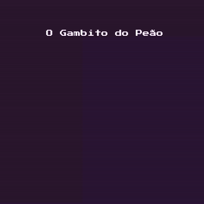

# O Gambito Do Peão V0.1 (Alpha)

O Gambito Do Peão (The Pawn's Gambit) é um jogo 2D single player bullet hell/heaven de sobrevivência com gráficos pixel art com o objetivo de sobreviver uma quantidade de tempo e enfrentar o chefão final em um tabuleiro de xadrez.

  

Sim! Um tabuleiro de xadrez! Você joga como Roberto, um grão-mestre de xadrez que estava terminando seu dia de treino quando recebeu uma notificação misteriosa para jogar uma partida de xadrez online. Ele, despretensioso, aceita o desafio mas logo percebe que não se trata de uma partida convencional e é teleportado para o mundo no qual ele deve sobreviver a ondas de peças de xadrez inimigas se quiser ter uma chance de voltar para o mundo real (ou talvez não!)

