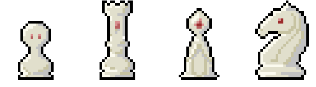

# O Gambito Do Peão V0.1 (Alpha)

O Gambito Do Peão (The Pawn's Gambit) é um jogo 2D single player bullet hell/heaven de sobrevivência com gráficos pixel art feito na Godot 4.3 e com o objetivo de sobreviver uma quantidade de tempo e enfrentar o chefão final em um tabuleiro de xadrez.

  

Sim! Um tabuleiro de xadrez! Você joga como Roberto, um grão-mestre de xadrez que estava terminando seu dia de treino quando recebeu uma notificação misteriosa para jogar uma partida de xadrez online. Ele, despretensioso, aceita o desafio mas logo percebe que não se trata de uma partida convencional e é teleportado para o mundo no qual ele deve sobreviver a ondas de peças de xadrez inimigas se quiser ter uma chance de voltar para o mundo real (ou talvez não!)

 

## Mecânicas

Em O Gambito do Peão, você controla o nosso grão-mestre andando com WASD ou as setas do teclado, além de um arranque (dash) com a barra de espaço.

Cada peça tem um ataque único e se movimenta respeitando as regras do xadrez tradicional.

Cada peça derruba um cristal de experiência que o ajuda a subir de nível!

Além da ação frenética, é possível encontrar equipamentos e upgrades conforme sobrevive às hordas de peças! No momento, temos:
 - Marreta: Objeto forte que gira ao seu redor destruindo tudo que toca! (acumulável!)
 - Blaster: Objeto que atira um projétil à distância e rápido!
 - Manto do Rei: Aura que envolve e corrói peças próximas!
 - Upgrades de dano, vida, velocidade, defesa, evolução de equipamentos e mais!

Na versão atual, o objetivo é sobreviver 10 minutos com eventos ativados em certos momentos do jogo!

## Próximas atualizações
Com o tempo, é esperado a adição de novas características e features como:
 - Melhorias visuais.
 - Novos equipamentos para diversificar builds.
 - Novos upgrades.
 - Itens! Cada um com uma característica própria ou habilidade nova!
 - Mais eventos com recompensas.
 - Confronto de chefão final contra o Rei e a Rainha.
 - E mais!

 

## Jogue a versão atual!
No momento, temos a versão para [windows e linux](https://drive.google.com/drive/folders/1j8-biWYGvQ0iEHgulk_0X-F9ajz1F1Ix?usp=sharing) no drive! Versão web ficará pronta em versões mais atualizadas.
OBS: Na versão linux pode ser necessário permitir que o arquivo rode. No caso, apenas clique com o botão direito do mouse -> preferências -> permitir execução do arquivo
